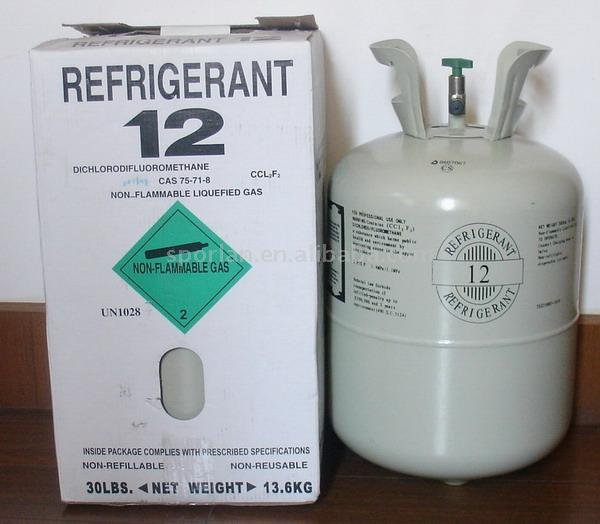
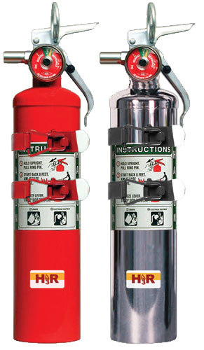
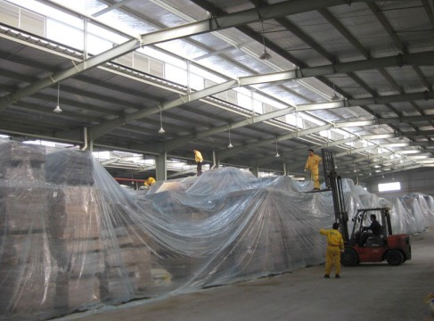
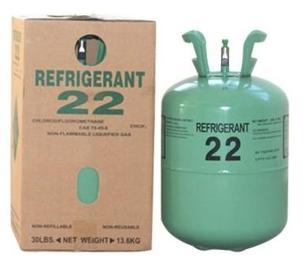
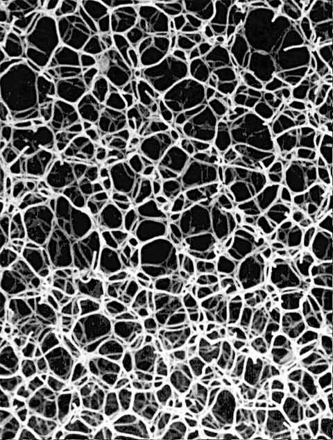
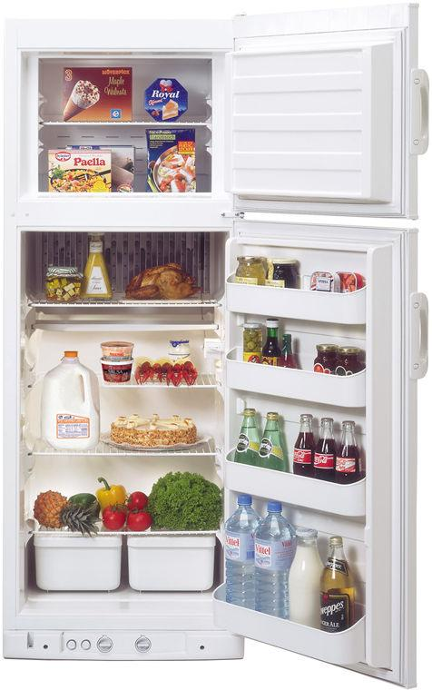
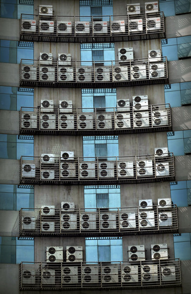
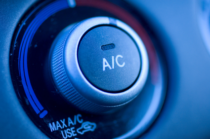
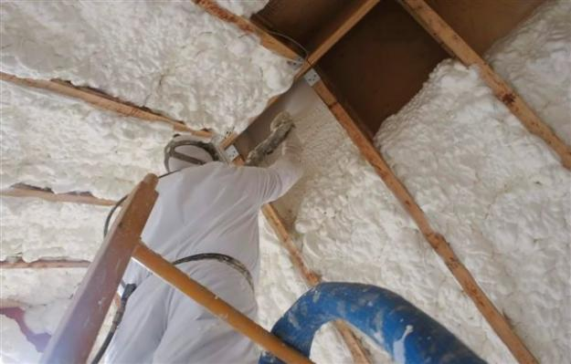

% 当代主流 ODS 替代品介绍
% 环境保护对外合作中心 徐浩洋
% 2014年3月

# ODS 用途

## {.note}

### Notes {.note}

在介绍 ODS 的替代品之前，我们先看看主要的 ODS 都用在哪些用途。

## CFC 物质的用途

### CFC-11

+ 泡沫行业

+ 烟草行业

### CFC-12

+ 空调制冷行业

+ 泡沫行业

+ 气雾剂行业

### CFC-113

+ 清洗行业

### CFC-114、CFC-115

### Notes {.note}

+ CFC-11 主要用在聚氨酯泡沫行业。

+ 在烟草行业作为烟丝膨胀剂。

+ CFC-12 从20世纪20年代起就作为制冷剂得到广泛应用。

+ CFC-12 也可作为发泡剂在聚苯乙烯、聚乙烯泡沫生产中使用。

+ CFC-12 被用于气雾剂行业，气雾剂包括皮肤用、腔道粘膜用、和通过呼吸道吸入的气雾剂。

+ CFC-113 主要用于电子清洗。

## 哈龙类物质的用途

+ 消防行业

### Notes {.note}

+ 哈龙用作灭火剂具有灭火效率高、速度快、无残留、适用范围广等优良性能。曾广泛用于军事、文物保护等用途。

+ 我国使用的主要是哈龙1211和哈龙1301。

## 四氯化碳的用途

+ 清洗行业

+ 生产 CFC-11 和 CFC-12 的原料

+ 化工助剂

### Notes {.note}

+ 用于机械和电子清洗。

+ 助剂即化工行业使用的添加剂，用来改变原材料的性质或者对原材料进行加工处理。

## 甲基氯仿的用途

+ 清洗行业

### Notes {.note}

+ 用于仪器仪表清洗。

## 甲基溴的用途

+ 农业

# HCFC 在部分领域替代 CFC

## HCFC-22

+ 空调制冷行业：替代 CFC-12 和 CFC-11

+ 泡沫行业：替代 CFC-12

### Notes {.note}

+ 在泡沫行业使用少量作为混合发泡剂的组分。

+ 以及在聚苯乙烯/聚乙烯发泡中作为发泡剂。

## HCFC-123

+ 空调制冷行业：替代 CFC-12

## HCFC-141b

+ 聚氨酯泡沫行业：替代 CFC-11

## HCFC-142b

+ 制冷行业：替代 CFC-12

# ODS 替代品

## {.note}

### Notes {.note}

为了方便大家在管理工作中参考，这部分按照行业划分，分别介绍各领域中的替代物质。

## 家用冰箱行业

+ CFC-12（R12）

+ → 异丁烷（R600a）[@lindeag:rg]

    - GWP：~4
    - 无毒性
    - 可燃性
    - POPs

+ → HFC-134a（R134a）

    - GWP：~1410
    - 无毒性

### Notes {.note}

+ 我国在冰箱行业 CFC 淘汰中，一步到位以 R600a 为主要制冷剂。

+ 美国、欧洲部分国家使用 R134a。我国冷量较大或者用于出口的部分冰箱产品也使用 R134a。

## 房间空调器行业

+ HCFC-22（R22）

+ → 丙烷（R290）

    - GWP：~3
    - 无毒性
    - 可燃性
    - POPs

+ → R410A（混合制冷剂）

    - GWP：~2100
    - 无毒性

+ → HFC-161（R161）

    - GWP：~10
    - 无短期毒性

### Notes {.note}

+ 还有一些基于丙烷的制冷剂，以 HCR22 等名称在市场上销售，用于直接替代现有机器中的 R22，这类制冷剂目前尚没有统一的控制标准。

+ R290 具有较高的可燃性，但家用空调充灌量一般较低，因此在加入必要的安全措施后可继续使用。

+ R410A 技术较为成熟，而且可以用在冷量/充灌量高的系统中，但 GWP 值高，很快会受到气候变化方面公约法规的限制。

+ R161 作为制冷剂的性质优良，可燃性略弱于 R290，正在进行进一步研究如长期毒性测试。

## 工商制冷空调行业

+ HCFC-22

+ → HFC-32（R32）

    - GWP：~675
    - 无毒性
    - 微可燃性

+ → HFC-134a（R134a）

+ → R410A

+ → NH~3~

    - GWP：0
    - 毒性
    - 可燃性
    - 刺激性气味

+ → CO~2~

    - GWP：1
    - 无毒性

### Notes {.note}

+ R32 是 R410A 的组分之一，事实上是决定 R410A 制冷能力的主要组分。效率较高，改造成本可接受，是行业现阶段主要的替代品。由于充灌量限制，不能用于多联机和冷水机组等大型系统。

+ R134a 主要用于大型机组。R410A 主要用于多联机。这些应用暂时没有更好的替代方案。

+ 氨是一直在冷库等应用中使用的天然制冷剂，技术较成熟。效率高，对环境基本无破坏，但有毒性和可燃性，对制造和管理要求较高。欧洲一些国家正在将其应用到中央空调领域。

+ 二氧化碳可用于小型热泵等领域，是很有潜力的替代制冷剂。国内相关研究和应用刚刚起步，日本等国已有商业化产品，如可口可乐贩售机和热泵热水机。难点主要是压力容器制造、压缩机制造、在低纬度地区的效率。

## 汽车空调行业

+ CFC-12

+ → HFC-134a（R134a）

+ → CO~2~

+ → HFO-1234yf

    - GWP：~4
    - 无毒性
    - 微可燃性

### Notes {.note}

+ HFC-134a 是目前广泛使用的替代品，由于较高的 GWP 值，今后的应用将受到限制。由于价格较高，国内存在假冒伪劣。

+ CO~2~ 主要是德国汽车制造商在推广，在高温条件下效率一般，且压力容器增加系统重量，这两点可能造成汽车油耗增加。

+ HFO-1234yf 有可能成为主流的汽车空调制冷剂，可直接注入现有系统[@cao:2008xy]。有专利保护并且合成困难，生产成本高，预计价格也较高。

## 聚氨酯泡沫行业

+ HCFC-141b

+ → 环戊烷

    - GWP：~11
    - 无毒性
    - 可燃性

+ → 水

    - GWP：~0

+ → HFC-245fa

    - GWP：~990
    - 低毒性

+ → HFC-365mfc

    - GWP：~890

### Notes {.note}

+ 环戊烷是当前的主要替代技术，一般工艺下，获得的泡沫的导热系数略高于 HCFC-141b 技术生产的泡沫，13 vs 10.1 mW/(m.K)[@guan:2013bx]

+ 水发泡是另一受关注的替代技术，但目前使用该技术生产的泡沫泡孔较大，尺寸稳定性差，影响了其应用[@peng:2009qs]。

+ HFC-245fa 在美国和欧洲应用比较广泛，隔热性能介于环戊烷和 HCFC-141b 之间[@feng:2005xx]。也可能与水组成混合发泡剂，改善水发泡的性质。虽然 HFC-245fa 的 GWP 较高，有研究认为在冰箱中，全寿命期间的 TEWI 值优于使用环戊烷发泡。HFC-245fa 目前的价格还比较高。

+ HFC-365mfc 通过合理调配聚醚的配比，可以实现较低的导热技术，适合太阳能行业用途。主要缺点是工艺成本较高，国内只有少数领先企业在使用[@liu:2010ty]。

## 聚苯乙烯/聚乙烯泡沫行业

+ HCFC-22，HCFC-142b

+ → CO~2~

+ → HFC-152a

    - GWP：~140
    - 可燃性

+ → 丁烷

    - GWP：~20
    - 可燃性

### Notes {.note}

+ CO~2~ 是当前主要考虑的替代技术。产品需要解决热导率和阻燃性能不佳的问题[@wang:2011zg]。

+ HFC-152a 是美国为主采用的发泡技术，可取得和 HCFC 发泡相近的产品性能。主要问题是成本。

+ 丁烷等碳氢发泡剂在日本得到应用。在我国尚缺少使发泡产品达到阻燃要求的经验。

## 清洗行业

+ HCFC-141b

+ → HFC-365mfc

+ → n-PBr

    - 慢性毒性

+ → HC

### Notes {.note}

+ HFC-365mfc 价格高，供应量少。

+ n-PBr 性质与 TCA 相近，用途广泛。由于其慢性毒性，需要投入措施加强设备密封和厂房通风[@wang:2013xb]。

+ 碳氢清洗剂清洗工艺简单，成本适中，对油溶解能力强。由于碳氢的可燃性，必须采用防爆措施，同时加强管理[@tang:2007qx]。

+ 也可能用其他清洗手段代替有机溶剂清洗。

## 甲基溴熏蒸行业

+ 甲基溴

+ → 甲基碘

+ → 氯化苦

+ → 棉隆

+ → 威百亩

+ → 3-二氯丙烯

### Notes {.note}

+ 甲基碘性质类似甲基溴，费用高。近年来使用似乎不广。

+ 其他几种都不够广谱，但可以通过合并使用弥补不足。

+ 还有一些非化学方法，减少作物对农药的依赖。

## 烟草行业

+ CFC-11

+ → CO~2~

### Notes {.note}

+ 以液态CO2为介质，对烟丝进行浸渍，然后在热气流中加热，烟丝中的CO2快速挥发，导致烟丝产生膨胀。

## 气雾剂行业

+ CFC-12

+ → HFC-134a

+ → HFC-227ea

+ → 二甲醚

    - 可燃性

+ → 压缩空气

### Notes {.note}

+ HFC-134a 气雾剂价格较高。处方和材料相容性的处理较麻烦。

+ 二甲醚毒性低，性质稳定，具有水溶性和醇溶性。尤其适用于水溶性的气雾剂[@wang:2008wg]。

## 消防行业

+ 哈龙

+ → HFC-227ea

+ → HFC-236fa

+ → CO~2~

+ → 惰性气体

### Notes {.note}

+ HFC-227ea 使用较广泛，灭火效率高，和哈龙相比也较经济。

+ HFC-236fa 灭火性能强于二氧化碳灭火器但弱于哈龙。可用于电器、文件场所的保护。

## 小结

+ 环境保护的要求使得低 GWP 替代品更受重视，但其可燃性问题需要采取相应措施。

+ 替代品的选择涉及到多方面考虑，在一些行业中比其他的更加复杂。

+ 替代品的选择和优化是仍在进行的过程。

## 参考资料
